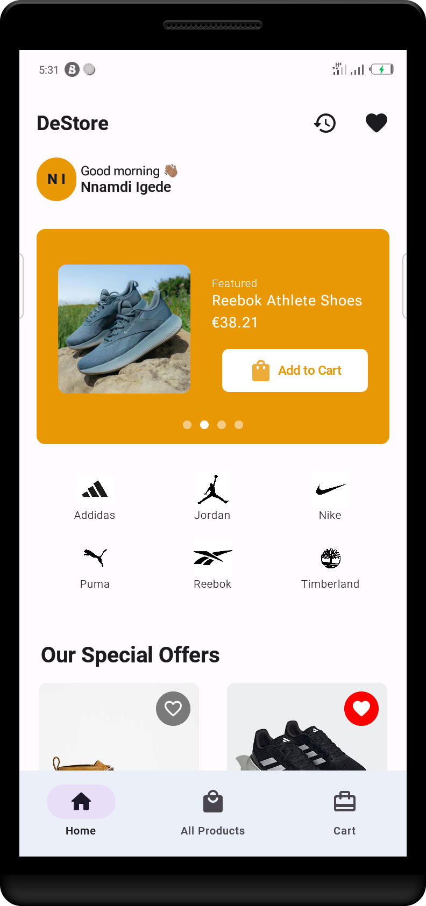
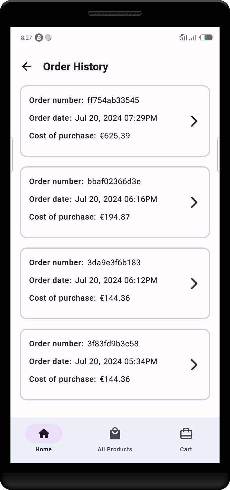

# DeStore
This sample shopping app is a task from HNG11 stage 3 & 4.

A modification of [Outlet project](https://github.com/Nnamodi/Outlet)

## Screenshots
|::::::::::::::::::::::::::::::::::::::::|::::::::::::::::::::::::::::::::::::::::|::::::::::::::::::::::::::::::::::::::::|::::::::::::::::::::::::::::::::::::::::|::::::::::::::::::::::::::::::::::::::::|::::::::::::::::::::::::::::::::::::::::|
|:--:|:--:|:--:|:--:|:--:|:--:|
|||||||

## Features
* Shows list of products fetched from remote source
* Displays product details
* Explore products by category
* Requires internet connection
* Add to and remove from cart
* Handles error state properly
* Saves and displays order history in details

## About

* Shows a list of products/items remotely fetched from the [Timbu API](https://docs.timbu.cloud/api/intro).
* Clean and Simple Material UI

* This project was built with Clean Architecture and MVVM pattern.

    There are two _modules_ in this project:

    `app` - The main module serving as the user interface/communication layer

    `domain` - Houses the entities and use-cases

    `localDataSource` - Stores and fetches stored data (like cart items, wishlist, order history), from local source using persistence frameworks

    `remoteDataSource` - Fetches data from internet and manipulates it
 

  ***Explore the virtualized demonstration of the release apk version [here](https://appetize.io/app/b_lu3o26f6m4b6dgdyig7ghwejuu)***

  ***Or you can install the apk from below 👇🏽***

  

## Build Instructions
You can build the app via Android Studio, or by running the following command in your directory:

    ./gradlew <assembleDebug | assembleRelease>

   You can then find the apk file in `DeStore/app/build/outputs/apk`

## Developed with
* [Jetpack Compose](https://developer.android.com/jetpack/compose) - Jetpack Compose is Android’s recommended modern toolkit for building native UI.
* [Coil-kt](https://coil-kt.github.io/coil/compose) - Image loading for Android and Compose Multiplatform.
* [Koin](https://insert-koin.io/docs/setup/koin/) - Reduces boilerplate of doing manual dependency injection in your project.
* [Material3](https://m3.material.io) - Google's latest design system with adaptable components and tools that support the best practices of user interface design for building beautiful apps.
* [Kotlin Coroutine](https://kotlinlang.org/docs/coroutines-overview.html) - For executing tasks asynchronously.
* [ViewModel](https://developer.android.com/topic/libraries/architecture/viewmodel) - Stores UI-related data that isn't destroyed on UI changes.
* [Retrofit](https://square.github.io/retrofit) - A type-safe HTTP client for Android and Java.
* [Moshi](https://sqaure.github.io/moshi) - A modern JSON library for Kotlin and Java.
* [OkHttp](https://sqaure.github.io/okhttp) - An efficient HTTP & HTTP/2 client for Android and Java.
* [Room Database](https://developer.android.com/training/data-storage/room) - A persistent local data storage library.
